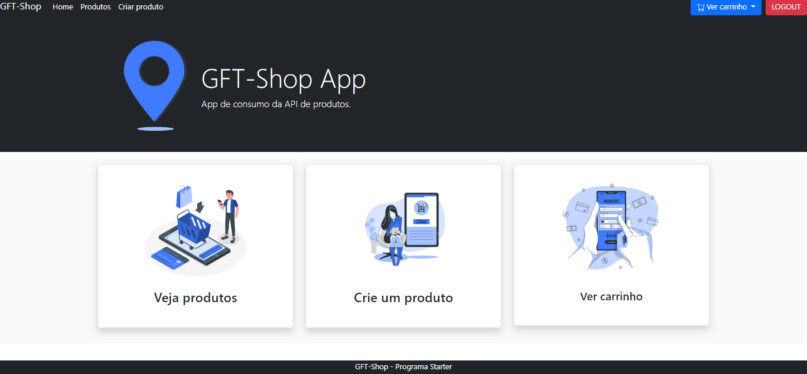
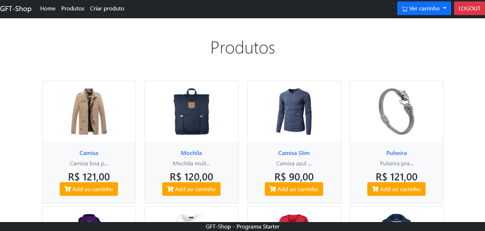
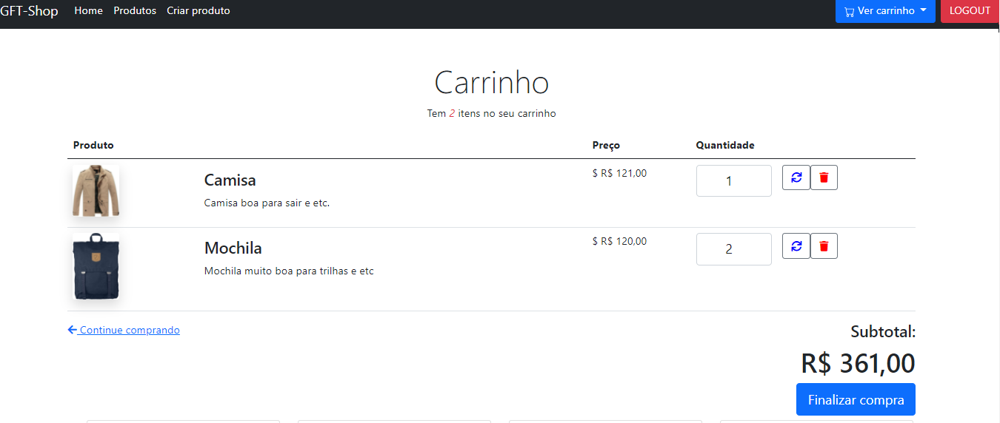
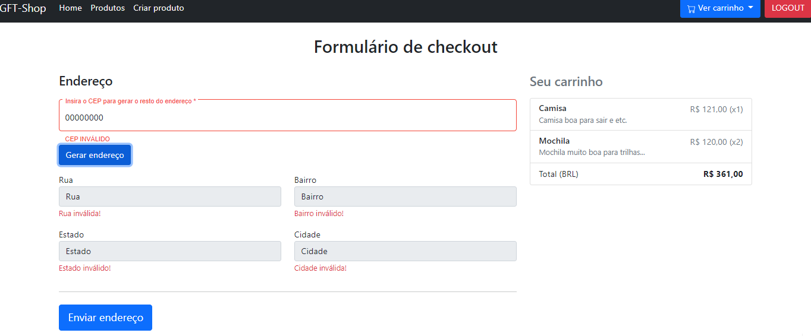
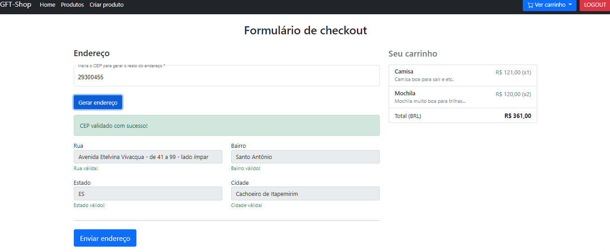
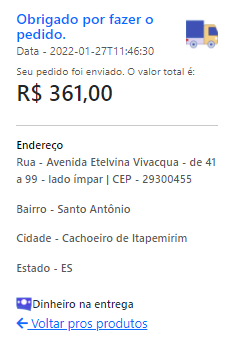
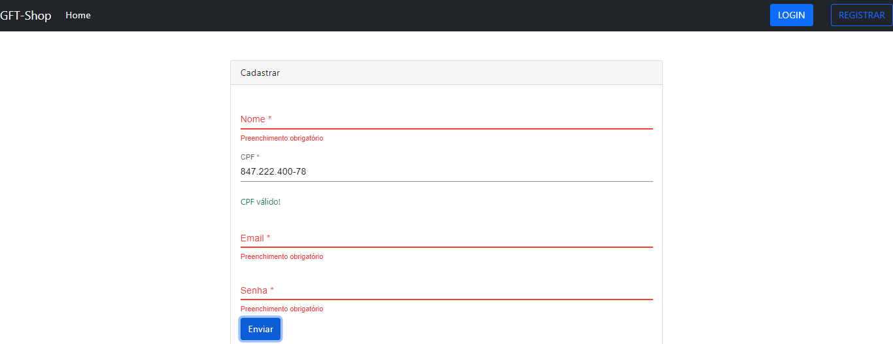

# GFT Shop App

## Logins de teste
+ Um usuário
  + email: usuario@email.com
  + senha: Gft2021
+ Outro usuário
  + email: outro@email.com
  + senha: Gft2021

+ **[ ❗ ] Ou você pode cadastrar um usuário**

## API feita pra consumo
[Está nesse repositório!!](https://github.com/raquelvaladao/ecommerce-backend)

## Versão Nodejs
+ **17.2.0**

## Fluxo

+ [✔] Cadastro do Usuário
+ [✔] Autenticação do Usuário
+ [✔] Cadastro do Produto
+ [✔] Carrinho de Compra
+ [✔] Finalizar Compra 

+ Obrigatório
  + [✔] Os cadastros e  os  dados  relacionados  às  vendas/carrinho  de  compras  deverão ser armazenadosem  banco  de  dados via  API
  + [✔] Para acessar as páginas (exceto a de autenticação), o usuário deverá estar logado 
  + [✔] O CPF do usuário deverá ser validado via API
  
+ Exceeds
  + [✔] Cadastre  também  o  endereço  para  onde  o pedido  está  sendo  enviado,  nesse  caso,  o endereço deverá ser recuperado via API
  + (Cancelado): <s> Integre a aplicação com o google MAP’s e apresente no mapa o percurso que compreende o ponto de origem da encomenda até seu destino </s>

# Algumas fotos

## Home (pra um usuário logado)
 

## Produtos
 

## Carrinho
  

## Checkout quando CEP é inválido
  

## Checkout quando CEP é válido
  
 
## Pedido enviado para CEP  válido
  
 
## Formulário de cadastro de um usuário com CPF válido
 

## Rodar
Run `ng serve` for a dev server. Navigate to `http://localhost:4200/`. The app will automatically reload if you change any of the source files.

## Créditos
+ Ilustrações por: **STORYSET.COM**

 
